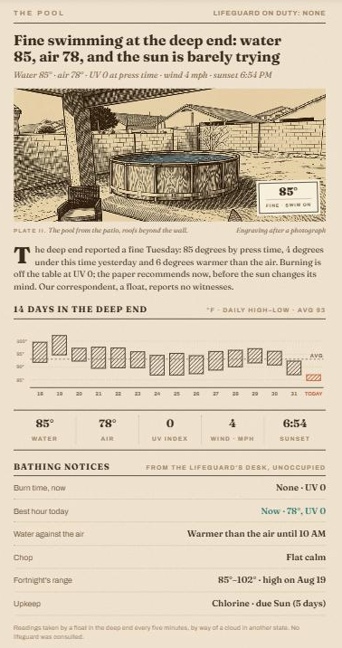

# Homestead Pool Card

A "Swimming Conditions" news article for a newsprint Home Assistant dashboard — companion to the [Almanac Weather Card](https://github.com/LoneWolf345/almanac-weather-card), the [Network Ledger Card](https://github.com/LoneWolf345/network-ledger-card), the [Homestead Classifieds Card](https://github.com/LoneWolf345/homestead-classifieds-card) and the [Homestead Waterworks Card](https://github.com/LoneWolf345/homestead-waterworks-card).



**What it prints**

- **A woodcut plate** of the pool printed in multiply on the paper, with the water temperature and verdict on a pasted tag. Three plates ship in [`docs/plates/`](docs/plates) — day, night and storm — and the card picks one: **storm** when the current condition or the next few forecast hours are stormy, **night** after sunset, **day** otherwise.
- **A verdict headline and lede** — "Warm swimming at the deep end: water 88, air 104, and the sun is not on your side" — from the water temperature (closed by cold → bracing → brisk → fine → warm → bathwater), the air, and the UV index.
- **Fourteen days in the deep end** — hatched daily high–low bars from recorder history, today in terracotta, dashed average line.
- **The strip** — water · air · UV · wind · sunset (sunrise after dark).
- **Bathing notices** from the lifeguard's desk, unoccupied: burn time at the current UV, the best swim hour from the hourly forecast, when the water beats the air, chop from the gusts, the fortnight's range, and the soonest pool chore from Maintenance Supporter.

Read-only: tapping anything opens its more-info dialog.

## Requirements

- A pool thermometer in Home Assistant (here a Govee H5109 float read through the Govee cloud by a `command_line` sensor). Give it `state_class: measurement` so statistics accrue; the card itself reads raw history (`history/history_during_period`).
- Optional: outdoor temperature / UV / wind / gust sensors, a `weather` entity with an hourly forecast, `sun.sun`, and [Maintenance Supporter](https://github.com/) tasks for the pool.

## Installation (HACS)

1. HACS → Custom repositories → add this repo, category **Dashboard**
2. Install **Homestead Pool Card**
3. Copy the plates from `docs/plates/` to `config/www/pool/` (or use your own images)
4. Add the card:

```yaml
type: custom:homestead-pool-card
water_entity: sensor.pool_temperature
air_entity: sensor.weather_station_temperature
uv_entity: sensor.weather_station_uv_index
wind_entity: sensor.weather_station_wind_speed
gust_entity: sensor.weather_station_wind_gust
weather_entity: weather.home
sun_entity: sun.sun
plates:
  day:   { src: /local/pool/plate-lawn.jpg,  caption: The pool from the patio, roofs beyond the wall. }
  night: { src: /local/pool/plate-night.jpg, caption: The pool by moonlight, the patio in shadow. }
  storm: { src: /local/pool/plate-storm.jpg, caption: The pool under a thunderhead, the sapling leaning away from it. }
chores:
  - { name: Chlorine, entity: sensor.pool_add_chlorine }
  - { name: Filter clean, entity: sensor.pool_clean_pool_filter }
  - { name: Filter change, entity: sensor.pool_replace_pool_filter }
```

## Options

| Key | Default | Notes |
|---|---|---|
| `water_entity` | required | Pool thermometer, °F; also the history id |
| `air_entity`, `uv_entity`, `wind_entity`, `gust_entity` | `''` | Outdoor sensors; wind in mph |
| `weather_entity` | `''` | Hourly forecast via `weather/subscribe_forecast` (best hour, water-vs-air, storm plate) |
| `sun_entity` | `sun.sun` | Sunset/sunrise and the night plate |
| `days` | `14` | Completed days in the chart/average |
| `air_max`, `uv_max` | `100`, `5` | Ceilings for the best swim hour |
| `storm_hours` | `6` | Forecast window for the storm plate (stormy condition or ≥ 50 % precipitation) |
| `plates` | `{}` | `day` / `night` / `storm` → `{src, caption}` (a bare URL works). `plate` + `plate_caption` is accepted as `day` |
| `plate_number`, `plate_credit` | `II`, `Engraving after a photograph` | Caption line under the plate |
| `tag_position` | `br` | `br` · `bl` · `tr` · `tl` |
| `chores` | `[]` | `[{name, entity}]` Maintenance Supporter sensors (uses `days_until_due` / `next_due` / state) |
| `title`, `kicker`, `footer`, `column_rule` | `THE POOL`, `LIFEGUARD ON DUTY: NONE`, house line, `false` | Kicker, right kicker, footer, newspaper gutter rule (`--almanac-column-rule`) |

## Copy rules

Verdict by water °F: < 70 closed by cold · 70–76 bracing · 76–80 brisk · 80–86 fine · 86–90 warm · ≥ 90 bathwater. Burn time by UV: < 3 an hour or more · 3–5 45 min · 6–7 30 min · 8–10 15–20 min · 11+ 10 min. Chop by gusts: < 8 flat calm · < 15 light · < 25 choppy · else whitecaps. The best hour is the forecast hour before sunset with UV ≤ `uv_max`, air ≤ `air_max`, no rain, lowest UV×2 + (air − 90)/2; after dark the answer is "now" while the air is under `air_max`.

## Theming

Honors `--almanac-paper` (set `transparent` for a one-sheet newspaper look), `--almanac-column-rule`, `--almanac-gutter`, `--ha-card-border-radius` / `--ha-card-box-shadow`. The card remembers its rendered height per device and pins it across re-renders so phones don't jump.

## Plates

`docs/plates/`: `lawn.jpg` (day), `night.jpg`, `storm.jpg` — the house's own yard, drawn from a photograph as two-color woodcuts (brown ink on cream, a slate-blue spot on the water), 912×387, meant to be printed in multiply. `alternates/` holds a closer take and the round-1 generic pool scenes (lawn, sundown, monsoon, ladder, from above, night) with their night/storm/rain variants.
